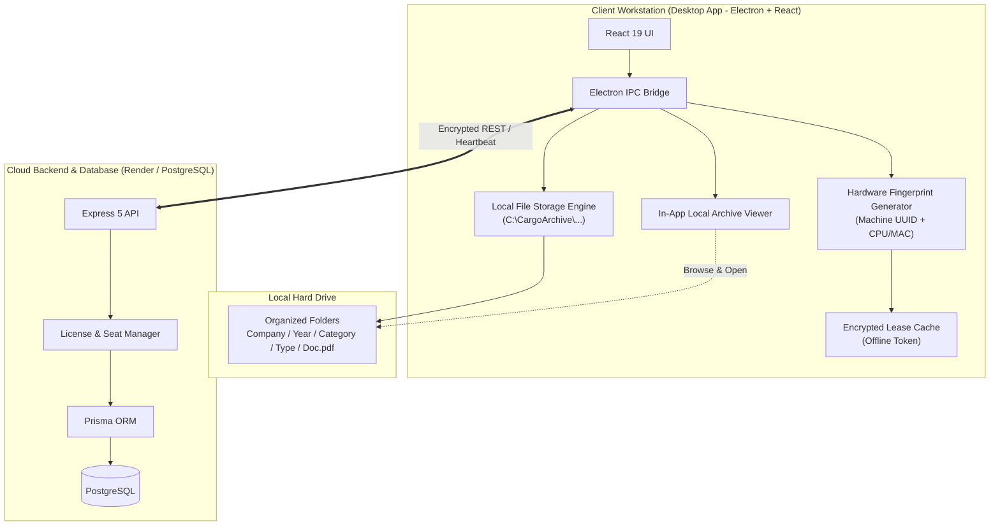

# Enterprise Desktop Software Blueprint: Local Document Storage & Subscription Licensing

This document defines the complete technical architecture and implementation roadmap to build an **Enterprise-Grade Desktop Software (Windows `.exe` & macOS `.dmg`)** for the **AWB / Cargo Management System**.

It addresses two core enterprise requirements:
1. **Automated Structured Local File Storage**: Automatically saving every generated document (PDF + Data) on the client's local computer in a clean, organized folder hierarchy, with an in-app Local File Explorer.
2. **Enterprise Subscription & Licensing Engine**: Hardware-bound license keys, concurrent seat allocation, cloud heartbeat verification, and an offline-resilient lease mechanism.

---

## 1. Enterprise Architecture Overview



---

## 2. Feature 1: Structured Local File Storage

### Folder Hierarchy Specification
Every time a document (AWB, Bill of Lading, Invoice, Manifest, Packing List, etc.) is created, validated, or exported, the desktop app automatically saves the PDF and JSON metadata into a standardized directory structure:

```
[User Chosen Root (Default: C:\Users\<User>\Documents\CargoArchive)]/
└── [Company_Name]/
    └── [Year_2026]/
        ├── Air_Freight/
        │   ├── MAWB/
        │   │   ├── 020-12345675.pdf
        │   │   └── 020-12345675.json        (Document snapshot & metadata)
        │   ├── HAWB/
        │   │   ├── HAWB-998822.pdf
        │   │   └── HAWB-998822.json
        │   ├── Cargo_Pouch_Labels/
        │   └── Manifests/
        ├── Sea_Freight/
        │   ├── Bill_of_Lading/
        │   │   ├── BL-776655.pdf
        │   │   └── BL-776655.json
        │   └── Sea_Manifest/
        └── Invoices_and_Finance/
            ├── Tax_Invoice/
            │   ├── INV-2026-0045.pdf
            │   └── INV-2026-0045.json
            └── Purchase_Bills/
                └── PB-2026-0012.pdf
```

### Key Storage Capabilities:
1. **Configurable Base Path**:
   - In Settings, the user or IT administrator can choose any storage folder (e.g. `D:\CargoData` or a mapped network drive `Z:\WarehouseShared\Documents`).
2. **Dual Saving (PDF + JSON)**:
   - Saves the final formatted PDF for printing/emailing.
   - Saves the raw JSON data so the document can be loaded back into the editor anytime even if cloud servers are unreachable.
3. **In-App Local File Explorer / Archive**:
   - A dedicated **"Local Archive"** view within the software.
   - Filter by Year, Month, Document Category, or search by Document Number / Consignee.
   - One-click actions:
     - **Open PDF**: Opens directly in default OS PDF viewer or built-in preview.
     - **Show in Folder**: Opens Windows Explorer / macOS Finder highlighted on that file.
     - **Print**: Direct silent or standard print.
     - **Open in Editor**: Reloads the document into the editor.

---

## 3. Feature 2: Enterprise Subscription & Licensing Engine

To monetize and protect the software as an enterprise product, we introduce a **Hardware-Locked Multi-Seat Licensing System**:

### How the Licensing Model Works:

```
License Key Format: CRGO-[TIER]-[RANDOM_CHUNKS]-[CHECKSUM]
Examples:
  CRGO-ENT-A8F2-99C1-72B4 (Enterprise Tier)
  CRGO-PRO-B114-6F39-44D1 (Professional Tier)
```

| Component | Functionality |
| :--- | :--- |
| **Hardware Fingerprint** | Electron collects non-reversible machine hardware identifiers (Motherboard UUID, CPU ID, MAC address) using `node-machine-id`. |
| **Seat Management** | An Enterprise subscription allows **N concurrent devices** (e.g., 5 seats for a 5-operator office). When seat limit is reached, new devices cannot activate until an admin releases a seat. |
| **Cloud Validation Heartbeat** | The desktop client pings the licensing server periodically (every 24 hours or on app launch) to check license status (ACTIVE, EXPIRED, SUSPENDED, SEAT_REVOKED). |
| **Offline Resilience (Cryptographic Lease)** | If the warehouse internet disconnects, operators are not blocked immediately. The server issues a cryptographically signed **Lease Token** valid for a grace period (e.g., 7 days). The app functions offline until the lease expires. |
| **Remote Deactivation & Admin Control** | Admins can view active device names, OS, and last active IP in their Master Admin Portal, and remotely revoke seats if an employee leaves or a PC is replaced. |

---

## 4. Database Schema Extensions (Prisma)

To support multi-seat licensing and hardware binding, the backend PostgreSQL schema will be enhanced with:

```prisma
model DeviceSeat {
  id           String    @id @default(cuid())
  userId       String
  user         User      @relation(fields: [userId], references: [id], onDelete: Cascade)
  machineId    String    // Unique hardware fingerprint
  deviceName   String?   // e.g. "DESKTOP-WAREHOUSE-01"
  osPlatform   String?   // "win32" or "darwin"
  ipAddress    String?
  isActive     Boolean   @default(true)
  firstSeenAt  DateTime  @default(now())
  lastActiveAt DateTime  @default(now())

  @@unique([userId, machineId])
  @@index([machineId])
}
```

And updating the `User` model:
- `maxSeats`: Total number of allowed PCs.
- `allowedServices`: Granular module control (e.g., `["AIR_FREIGHT", "SEA_FREIGHT", "BILLING", "LEDGERS"]`).
- `offlineGracePeriodDays`: Default 7 days.

---

## 5. Step-by-Step Implementation Roadmap

### Phase 1: Electron Desktop Foundation
1. **Initialize Electron Layer**:
   - Add Electron runtime to project (`electron/main.cjs`, `electron/preload.cjs`).
   - Configure window behavior, custom titlebar/frame, app tray, and native menus.
2. **Hardware Fingerprinting Integration**:
   - Implement `machineId` collection in Electron main process.
   - Expose `window.electronAPI.getMachineInfo()` via secure context bridge.

### Phase 2: Local File Storage Engine (Electron Main Process)
1. **File System IPC Handlers**:
   - `storage:saveDocument`: Automatically resolves directory path `[Root]/[Company]/[Year]/[Category]/[Type]/`, creates subfolders recursively, and writes `.pdf` and `.json`.
   - `storage:listDocuments`: Scans the directory tree and returns indexed document listings to the frontend.
   - `storage:openFile`: Opens the file in the default OS application (`shell.openPath`).
   - `storage:showInFolder`: Reveals the file in Windows Explorer / macOS Finder (`shell.showItemInFolder`).
   - `storage:getConfig` / `storage:setConfig`: Stores and updates user-chosen storage root path via `electron-store`.

### Phase 3: In-App Local File Explorer & Settings (React Client)
1. **Local Archive Page (`/local-archive`)**:
   - Grid and Table views of all locally saved documents.
   - Quick filters: Category (Air/Sea/Finance), Document Type, Year, Month.
   - Search bar: Document number, Shipper/Consignee, Date.
   - Action buttons: "Open PDF", "Show in Folder", "Print", "Edit".
2. **Storage Settings in [SettingsPage.jsx](file:///c:/Users/gopal/Documents/Coding/awb/client/src/pages/SettingsPage.jsx)**:
   - Native OS folder selector button ("Browse..." button opening OS folder dialog).
   - Display storage stats (Total documents stored, disk space used).

### Phase 4: Enterprise Licensing Engine (Backend + Desktop Client)
1. **Backend Endpoints (`/api/license`)**:
   - `POST /api/license/activate`: Validates key, binds machine ID, verifies seat limit, returns signed lease token.
   - `POST /api/license/heartbeat`: Renews offline lease token and updates device `lastActiveAt`.
   - `POST /api/license/deactivate`: Releases a machine seat.
2. **Client-side License Guard**:
   - Validates lease on startup.
   - Shows banner or modal if license is nearing expiry or offline grace period is running out.
3. **Admin License Management UI in [MasterUsersPage.jsx](file:///c:/Users/gopal/Documents/Coding/awb/client/src/pages/MasterUsersPage.jsx)**:
   - View assigned seats per customer.
   - "Revoke Seat" button for individual machines.
   - Generate new license keys with custom seat counts and plan durations.

### Phase 5: Production Packaging (`electron-builder`) & CI/CD
1. **Configure `electron-builder.yml`**:
   - Windows: NSIS Installer (`.exe`) + Portable (`.exe`).
   - macOS: DMG Installer (`.dmg`) + App bundle (`.app`).
2. **Automate Multi-OS Releases**:
   - GitHub Actions workflow `.github/workflows/build-desktop.yml`.

---

## 6. Verification & Testing Plan

### Local File Storage Tests
- [ ] Save an AWB (e.g. `020-12345675`): Verify file is created at `C:\CargoArchive\<Company>\2026\Air_Freight\MAWB\020-12345675.pdf`.
- [ ] Verify matching metadata file `020-12345675.json` is generated.
- [ ] Open Local Archive in software: Verify the AWB appears in the list.
- [ ] Click "Show in Folder": Verify Windows Explorer opens directly to the file.
- [ ] Change storage folder in Settings: Verify future documents save to the new path.

### Enterprise Licensing Tests
- [ ] Activate license on PC 1: Verify 1 seat consumed in database.
- [ ] Activate license up to maximum seats: Verify next PC is rejected with "Seat limit reached".
- [ ] Disconnect internet: Verify app continues operating under offline lease grace period.
- [ ] Revoke seat from Master Admin panel: Verify client is locked out on next heartbeat.
